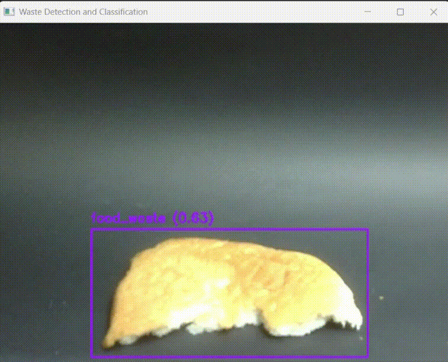

# Hybrid Object Detection and Classification System for Waste Sorting

This project combines **YOLOv8n** (object detection) and **EfficientNetB0** (image classification) into a hybrid pipeline to detect and classify waste items for smart waste management. It is developed as part of a Capstone Project submission.

---

## 📁 Project Structure

### 1. YOLOv8n Training and Tunings
This directory contains:
- Training scripts for YOLOv8n base model on custom dataset
- Hyperparameter tuning scripts and their evaluation output
- Trained weights for both the base and tuned YOLOv8n models
- Model evaluation on test data

> ⚠️ **Note**: The training dataset is not included due to size limitations. However, it is publicly accessible here:  
> 🔗 [Trash Dataset (Roboflow)](https://app.roboflow.com/cp2-gycrt/trash_dataset-ludqi/4)

---

### 2. EfficientNetB0 Training
This section includes:
- Scripts for training EfficientNetB0 on custom dataset
- Model evaluation output
- Training dataset used for reclassification 

---

### 3. Hybrid Model
This directory contains:
- Scripts and output for **4 test cases** using the hybrid model
- Trained weights for both YOLOv8n and EfficientNetB0
- Real-time detection script that combines detection and classification on live video feed

---

### 4. Model Evaluation on Unseen Dataset
This section contains:
- Unseen validation dataset
- Scripts and output for:
  - Evaluating YOLOv8n on unseen data
  - Evaluating Hybrid Model on unseen data

---

### 5. Requirements
All required dependencies are listed in `requirements.txt`.

To install:
```bash
pip install -r requirements.txt
```

---

## 🚀 Getting Started

To run the hybrid model in real-time:
```bash
python hybrid_detect.py
```

Make sure you are in the "Hybrid Model" directory, and both YOLOv8n and EfficientNetB0 weights are placed in the correct directories.

---

## 🎞️ Demonstration

Below is a short demo of the hybrid system in action:



> The demo shows YOLOv8n detecting waste objects while EfficientNetB0 refines their classifications in real-time. Here, a piece of half eaten bread is correctly detected as "food waste".

---

## 📊 Presentation Slides

For a detailed explanation of the project objectives, model architecture, evaluation results and more, refer to the project slides below:

🔗 [View Project Slides]([https://your-slide-link-here](https://www.canva.com/design/DAGuiBK2tx0/JlXiMMkWx1i2Wxllpo05kQ/view?utm_content=DAGuiBK2tx0&utm_campaign=designshare&utm_medium=link2&utm_source=uniquelinks&utlId=h297a1de4ce))

---

## 📌 Notes
- The hybrid model enhances classification precision by refining YOLOv8n predictions using EfficientNetB0.
- Results reported is the improvement of recall for food waste class from 0.46 to 0.56.
- Quantitative results and comparisons can be found in the project report. 

---

## 📄 License
This project is intended for academic use only.
